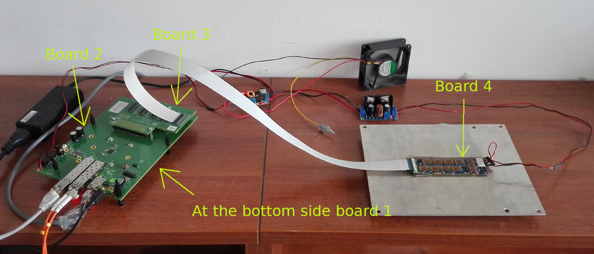

Overview
--------

FP2P (FPGA Port To Pin) is a tool for robust port to pin assignment in multi-board FPGA designs.
:numref:`fig_example_multiboard_fpga_design` shows an example of a multi-board FPGA design.

   Example of a multi-board FPGA design.
   This setup is a development setup and needs assignment for 42 differential signals.
   The final design needs assignment for 210 differential signals.

The problem has been known for a long time and is especially annoying in data acquisition systems, where hundreds of signals are routed via multiple boards.
However, there is still no generic user-friendly open-source solution (or at least none has been found).
The implementation has two main goals, safety (check as many potential human mistakes as possible) and reusability (reuse connections mappings, defined in files, in multiple designs).
It is fully declarative and programming language-agnostic from the users perspective.

License
=======

The project is licensed under the GPL-2.0 License.
