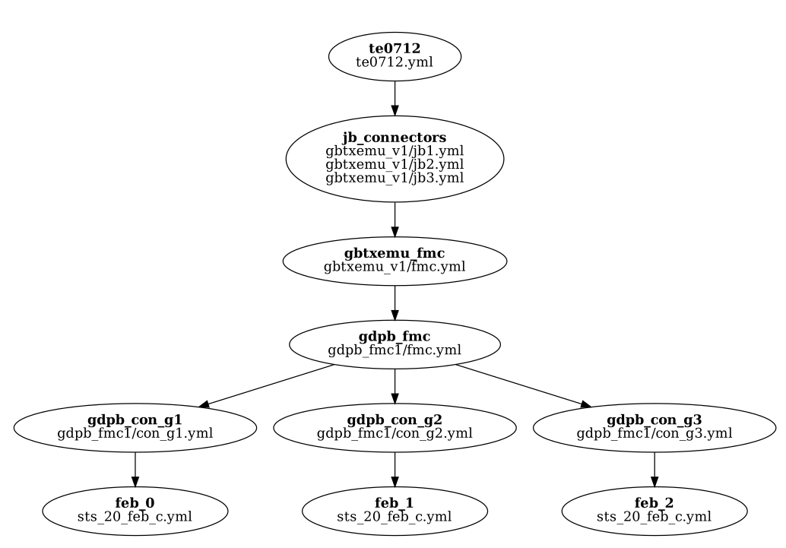

Subcommands
-----------

resolve
=======

The :code:`resolve` subcommand resolves mapping tree and prints it to the standard output.
It takes only single positional argument, namely the  tree file to resolve.
The :code:`resolve` subcommand is useful for debugging and in initial design phases to quickly check what is connected with what.

.. code-block:: python
   :caption: Example :code:`resolve` subcommand call.

   python fp2p.py resolve path/to/your/tree_file.yml

.. code-block:: python
   :caption: Example :code:`resolve` subcommand output.

   {'board_1': {'end_pin_4': {'pin': 'A4', 'terminal': None}},
   'board_2_connector_1': {'end_pin_1': {'pin': 'A1', 'terminal': None},
                           'led_0': {'pin': 'C2'}},
   'board_2_connector_2': {'end_diff_pin_n': {'pin': 'B12', 'terminal': None},
                           'end_diff_pin_p': {'pin': 'B13', 'terminal': None},
                           'end_pin_2': {'pin': 'A2', 'terminal': None},
                           'end_pin_3': {'pin': 'A3', 'terminal': None}}}

graph
=====

The :code:`graph` subcommand renders the graph for tree file.
It has been added to ease debugging of relatively long tree files.
After exceeding a certain number of nodes in the tree file it becomes a bit hard to see how nodes relate with each other and what files constitute particular nodes.
With graph it becomes trivial.

.. code-block:: sh
   :caption: Example :code:`graph` subcommand call.

   python fp2p.py graph path/to/your/tree_file.yml

:numref:`fig_example_graph` shows an example output graph.
Bold text within the node is the node name.
Below the node name there is a list of files constituting given node.

   Example output graph.

assign
======

The :code:`assign` subcommand is used for generating design constraint file.
This is the core reason why the fp2p tool has been implemented.

.. code-block:: sh
   :caption: Example :code:`assign` subcommand call.

   python fp2p.py assign tree.yaml assignment.yaml tmp.xdc

.. code-block:: sh
   :caption: Example auto generated design constraint file.

   # This file has been auto generated by the fp2p tool.
   # Do not modify it by hand!
   # More information on the website https://github.com/m-kru/fp2p.
   
   set_property PACKAGE_PIN A1 [get_ports {port[1]}]
   set_property IOSTANDARD LVDS_25 [get_ports {port[1]}]
   set_property DIFF_TERM TRUE [get_ports {port[1]}]
   
   set_property PACKAGE_PIN A2 [get_ports {port[2]}]
   set_property IOSTANDARD LVDS_33 [get_ports {port[2]}]
   set_property DIFF_TERM FALSE [get_ports {port[2]}]
   
   set_property PACKAGE_PIN A3 [get_ports {port[3]}]
   set_property IOSTANDARD LVDS_33 [get_ports {port[3]}]
   set_property DIFF_TERM TRUE [get_ports {port[3]}]
   
   set_property PACKAGE_PIN B12 [get_ports {diff_n}]
   set_property IOSTANDARD LVDS_33 [get_ports {diff_n}]
   set_property DIFF_TERM TRUE [get_ports {diff_n}]
   
   set_property PACKAGE_PIN B13 [get_ports {diff_p}]
   set_property IOSTANDARD LVDS_33 [get_ports {diff_p}]
   set_property DIFF_TERM TRUE [get_ports {diff_p}]
   
   set_property PACKAGE_PIN A4 [get_ports {port[4]}]
   set_property IOSTANDARD LVDS_33 [get_ports {port[4]}]
   set_property DIFF_TERM TRUE [get_ports {port[4]}]
